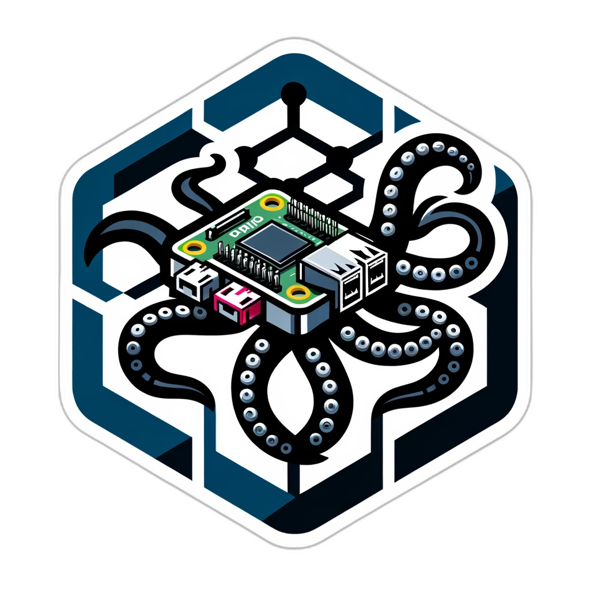

# Octoprint - OctoBox
'

## Overview

This project allows for different kinds of control and montor of external peripherals in OctoPrint, with the help of a Raspberry Pi Pico. 

## Features

- Control temperature sensors, heaters, fans, LEDs, and more in your 3D printer enclosure.
- Manage GPIO pins through Raspberry Pi Pico for enhanced performance and reliability.
- And More

## Installation

1. Todo: [Provide detailed installation steps for your version, particularly how to set up Raspberry Pi Pico with Raspberry Pi.]

## Hardware Compatibility

- Compatible with a range hardware
- Supports various output devices including relays, LEDs 

## Configuration

Todo: [Include steps on how to configure your version of the plugin, highlighting any new configuration options available with Raspberry Pi Pico.]

## Troubleshooting

Todo: [Offer troubleshooting advice specific to your version, or direct users to a section where they can find help.]

## Contribution

Contributions are welcome. Feel free to fork, modify, and send pull requests or open issues for further improvement.

## License

This project is licensed under GPL-3.0

## Acknowledgments

- Based on the [OctoPrint-Enclosure plugin](https://github.com/vitormhenrique/OctoPrint-Enclosure) by vitormhenrique and [OctoPrint GPIO Control plugin](https://github.com/catgiggle/OctoPrint-GpioControl) by catgiggle
- Pico core programmed using the [Arduino-Pico core](https://github.com/earlephilhower/arduino-pico/) by earlephilhower
- Hardware programming using [PlatformIO](https://platformio.org/)
- Using [LittleFS Library](https://github.com/littlefs-project/littlefs) by ARM Limited to store settings
- [Picotool.js](https://github.com/ArmDeveloperEcosystem/picotool.js) by ArmDeveloperEcosystem, to update Pico Firmware through OctoPrint
- [Any other acknowledgments or credits to contributors.]

